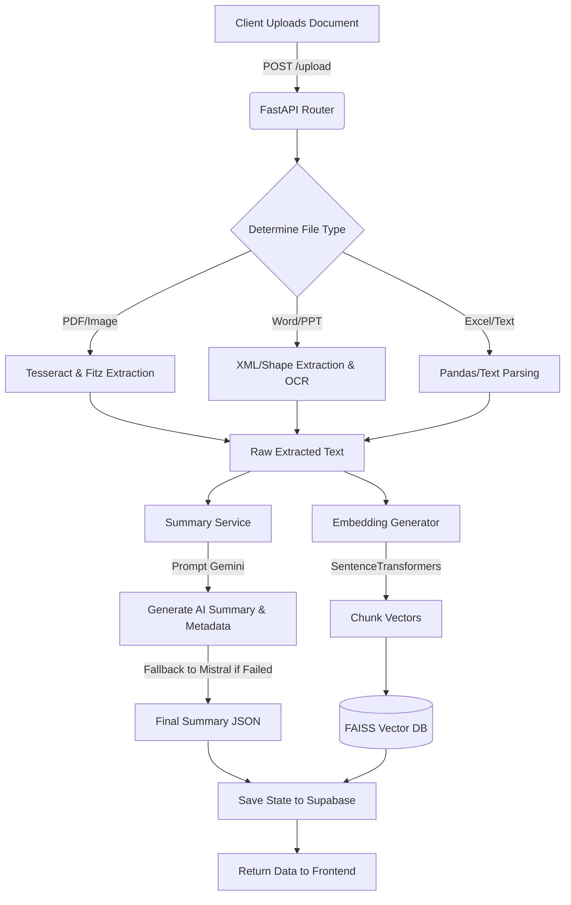

# 🔍 DocLens: Edge-AI Document Intelligence Workspace

   

🚀 **Live Demo:** [doc-lens-tau.vercel.app](https://doc-lens-tau.vercel.app/)

> ⚠️ **Note :** The core architecture of this platform is heavily optimized for zero-latency execution. However, the Live Demo backend is currently hosted on Render's **Free Tier (0.1 vCPU / 512MB RAM)**. Due to these severe hardware constraints, document processing and OCR times on the live demo will be artificially slower than the actual code capabilities. When run locally or on standard production hardware, processing is near-instantaneous.

**DocLens** is an enterprise-grade, high-performance document intelligence platform. It allows users to instantly upload documents of virtually any format, generate deep analytical summaries, securely chat with their data using Retrieval-Augmented Generation (RAG), and translate insights into over 25+ global languages—all wrapped in a stunning, frictionless Next.js user interface.

---

## 🌟 Executive Summary & Motivation
In the modern workflow, data is trapped inside flat files—PDFs filled with scanned images, heavily formatted Word documents, dense PowerPoints, and spreadsheets. Standard OCR tools are incredibly slow, and traditional LLM wrappers crash when dealing with complex or non-textual data. 

**DocLens solves this** by implementing a hyper-intelligent, multi-stage extraction pipeline. Instead of blindly passing documents to an AI, DocLens intelligently parses native text, isolates embedded images, targets OCR *only* where necessary, and injects the cleaned data into a local FAISS Vector Database for zero-latency querying.

---

## ✨ Comprehensive Feature Matrix

### 1. 📄 Universal Document Extraction & Parsing
DocLens doesn't just read text; it understands file structures.
*   **PDFs (Fitz & Tesseract):** Extracts native text effortlessly. Features an intelligent **per-page evaluation engine**—if it detects a page is a scanned image, or if it finds embedded pictures, it runs targeted OCR exclusively on those elements, skipping native text to ensure maximum speed and zero duplication.
*   **Word Documents (.docx):** Bypasses the strict limitations of standard libraries (`python-docx`). Uses manual XML unzipping (`document.xml`) to extract paragraphs and deeply mines document relations to extract and OCR embedded images.
*   **PowerPoint (.pptx / .ppt):** Parses slides, text boxes, tables, background fills, and picture shapes. 
*   **Images (.png, .jpg, .tiff):** Full optical character recognition using Tesseract.
*   **Spreadsheets (.xlsx) & Emails (.eml):** Token-optimized parsing that flattens data into readable context for the AI.

### 2. 🧠 Dynamic AI Summarization & Intelligence
Upload a document and receive an instant, structured analysis.
*   **Context-Aware Lengths:** Request an *Ultra-Concise* (50 words), *Standard*, or *Exhaustive* (400+ words) summary.
*   **Dynamic Language Detection:** The AI automatically scans the upload. If the document is purely in Hindi, Spanish, etc., the AI organically generates the summary and bullet points in that exact native language.
*   **Actionable Insights:** Automatically extracts critical metadata, document categorization, and key bullet points.

### 3. 🌍 Global Translation Engine (25+ Languages)
A seamless frontend UI allows users to instantly translate their Intelligence Summary into major global and Indian regional languages without re-processing the document.
*   **Global:** Spanish, French, German, Mandarin, Japanese, Russian, Arabic, and more.
*   **Regional (India):** Hindi, Bengali, Telugu, Marathi, Tamil, Urdu, Gujarati, Kannada, Odia, Malayalam, Punjabi, Sanskrit, and others.

### 4. 💬 Vector-Driven RAG Chat
*   **Local FAISS Indexing:** Documents are intelligently chunked (with token overlap) and embedded into a local FAISS vector store using high-performance HuggingFace SentenceTransformers (`all-MiniLM-L6-v2`).
*   **Semantic Search:** Ask a question, and the engine retrieves only the top-K mathematically relevant chunks.
*   **Source-Strict Prompting:** The LLM is strictly instructed to answer *only* using the provided context, virtually eliminating AI hallucinations.

### 5. 🛡️ High-Availability AI (Failover Architecture)
*   **Primary Engine:** Google Gemini Pro.
*   **Mistral Fallback:** If Gemini hits a rate limit, quota exhaustion, or a 500 error, the `AnswerGenerationEngine` gracefully and silently falls back to the **Mistral AI API**. The user never sees a disruption in service.

### 6. 🚀 Frictionless "Guest Mode" Architecture
*   Users do not need to create an account to start gaining value.
*   The system uses silent `guest_` tokens (stored locally via `localStorage`).
*   Documents and chat histories are saved to **Supabase (PostgreSQL)** tied to this guest token, isolating workspaces perfectly while eliminating onboarding friction.

---

## 🏗️ Technical Architecture

### Frontend (Client)
*   **Framework:** Next.js (App Router) + React 19
*   **Styling:** Tailwind CSS + Framer Motion (for liquid-smooth micro-animations, glassmorphism, and dynamic layout transitions).
*   **State Management:** React Hooks + Context API (`AuthContext`).
*   **Icons & UI:** Lucide React.

### Backend (API)
*   **Framework:** FastAPI (Python 3.12) running on Uvicorn.
*   **Database:** Supabase (PostgreSQL) for persistent document states and chat message histories.
*   **AI & ML:** 
    *   `google-generativeai` (Gemini)
    *   `mistralai` (Mistral Fallback)
    *   `sentence-transformers` (Embeddings)
    *   `faiss-cpu` (Vector Database)
*   **Document Processing:** `PyMuPDF` (fitz), `pytesseract`, `python-docx`, `python-pptx`, `pandas`, `BeautifulSoup4`.

### 🔄 Backend Pipeline Flow



---

## 💻 Local Development Setup

### Prerequisites
1.  **Node.js** (v18+)
2.  **Python** (v3.10+)
3.  **Tesseract OCR System Binary** (Must be installed on your OS and added to system PATH).

### 1. Clone & Configure
```bash
git clone https://github.com/your-username/doclens.git
cd doclens
```

### 2. Backend Setup
```bash
# Create and activate virtual environment
python -m venv venv
source venv/bin/activate  # On Windows use: .\venv\Scripts\activate

# Install dependencies
pip install -r requirements.txt

# Create a .env file in the root directory
# Add the following:
GEMINI_API_KEY=your_gemini_key
MISTRAL_API_KEY=your_mistral_key
SUPABASE_URL=your_supabase_url
SUPABASE_SERVICE_ROLE_KEY=your_supabase_service_key

# Start the FastAPI server
python start_server.py
```

### 3. Frontend Setup
```bash
cd frontend

# Install dependencies
npm install

# Create a .env.local file in the frontend directory
# Add the following:
NEXT_PUBLIC_API_URL=http://localhost:8000
NEXT_PUBLIC_FIREBASE_API_KEY=your_firebase_key
NEXT_PUBLIC_SUPABASE_URL=your_supabase_url
NEXT_PUBLIC_SUPABASE_ANON_KEY=your_supabase_anon_key

# Start the Next.js development server
npm run dev
```

---

## 🚀 Production Deployment Guide

Due to the heavy machine-learning dependencies and system binaries (Tesseract) required by the backend, the architecture must be split across two platforms for production.

### Step 1: Deploy Backend to a Docker Host (e.g., Render, Railway, Fly.io)
Vercel *cannot* host the backend due to serverless timeout and size limits.
1. Create a New Web Service on Render.com and connect your GitHub repository.
2. Render will automatically detect the provided `Dockerfile`.
3. The `Dockerfile` will install a lightweight Linux container, download the `tesseract-ocr` binaries, and compile the PyTorch/FAISS environment.
4. Input your Backend `.env` variables into the Render dashboard.
5. Deploy. You will receive a live URL (e.g., `https://doclens-api.onrender.com`).

### Step 2: Deploy Frontend to Vercel
Vercel is the perfect, lightning-fast host for the Next.js frontend.
1. Create a New Project on Vercel and connect your repository.
2. Set the **Root Directory** to `frontend/`.
3. In the Environment Variables section, set:
   * `NEXT_PUBLIC_API_URL` = `https://doclens-api.onrender.com` (Your URL from Step 1)
   * And your Supabase/Firebase public keys.
4. Deploy!

*DocLens will now seamlessly route all API requests from the serverless edge to your persistent machine-learning backend.*

---
*Built with ❤️ by the DocLens Team.*