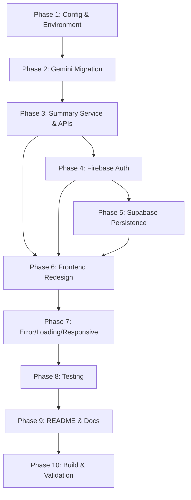

# Document Summary Assistant — Migration Plan

> **From:** LLM-Powered Intelligent Query–Retrieval System (Inquira)  
> **To:** Document Summary Assistant

---

## Existing Repository Inventory

### Backend (`start_server.py` + `src/`)

| File | Purpose | Keep / Modify / Replace |
|---|---|---|
| `start_server.py` | FastAPI app, endpoints (`/hackrx/run`, `/hackrx/upload`, `/health`), lifespan, bearer-token auth | **Modify heavily** — new endpoints, Firebase auth, summary pipeline |
| `config.py` | Env-based config (Mistral keys, model params) | **Modify** — add Gemini, Firebase, Supabase config |
| `src/document_text_extractor.py` | PDF (fitz), DOCX, XLSX, PPTX, PPT, Image/OCR, email, chunking (512w/50 overlap) | **Keep as-is** — core asset |
| `src/embedding_generator.py` | SentenceTransformer `paraphrase-MiniLM-L3-v2`, token-aware embeddings | **Keep as-is** |
| `src/faiss_vector_store.py` | FAISS IndexFlatIP, save/load, search, threshold search | **Keep as-is** |
| `src/query_resolver.py` | Query embedding → FAISS search → keyword enhancement → intent → answer | **Keep as-is** — used for Q&A flow |
| `src/answer_generation_engine.py` | Mistral primary, FreeLLM fallback, RuleBased fallback, batch, prompts | **Modify** — replace Mistral with Gemini as primary |
| `src/mistral_api_llm_engine.py` | Mistral SDK wrapper for agent | **Replace** with `gemini_llm_engine.py` |
| `src/llm_interaction_service.py` | Plan/instruction parsing using LLM for agent | **Modify** — point to Gemini engine |
| `src/intelligent_agent.py` | Multi-turn agent with RAG + API calls | **Keep** — still useful for dynamic docs |
| `src/agent_tools.py` | `api_call`, `text_parser`, `conditional_logic` | **Keep** |
| `src/open_source_llm_engine.py` | HuggingFace QA + text-gen fallback | **Keep** — remains fallback |
| `src/rule_based_answer_engine.py` | Pattern-matching fallback for insurance queries | **Keep** — remains fallback |
| `src/text_cleaner_utils.py` | Unicode/escape normalization | **Keep as-is** |
| `src/api_request_logger.py` | JSON file-based request logging | **Keep** — still useful for audit |
| `src/input_validator.py` | URL validation, ZIP bomb protection, agent detection | **Keep + extend** — add file-upload validation |

### Frontend (`frontend/`)

| File | Purpose | Keep / Modify / Replace |
|---|---|---|
| `package.json` | Next.js 16.3.1, React 19, TailwindCSS 3.4 | **Modify** — add Firebase SDK, Supabase client |
| `src/app/layout.tsx` | Root layout, Inter font, metadata | **Modify** — wrap with auth provider |
| `src/app/page.tsx` | URL-query form (batch analytics) | **Replace** — becomes Dashboard with upload |
| `src/app/chat/page.tsx` | Chat interface with file upload + bearer token | **Modify** — becomes Document Workspace (summary + Q&A) |
| `src/app/components/Navbar.tsx` | Simple nav (unused in current pages) | **Modify** — integrate into new layout |
| `src/app/globals.css` | Minimal TailwindCSS imports | **Modify** — add custom styles |

### Configuration

| File | Status |
|---|---|
| `.env` | ⚠️ Contains real Mistral key + bearer token — **must rotate & remove** |
| `.gitignore` | Missing `node_modules/`, frontend `.env*` — **update** |
| `requirements.txt` | Missing `google-generativeai`, `firebase-admin`, `supabase` — **update** |

---

## Phase-by-Phase Migration Plan

### PHASE 1 — Configuration & Environment Setup
**Estimated effort:** 30 min

**Scope:**
1. Update `config.py` to add Gemini, Firebase, Supabase settings
2. Create `.env.example` with all placeholder keys
3. Update `.gitignore` (add `node_modules/`, `.env.local`, `*.env`)
4. Update `requirements.txt` (add `google-generativeai`, `firebase-admin`, `supabase`)
5. Remove/rotate the real bearer token and Mistral key from `.env`

**Files affected:**
- `config.py` — add `GEMINI_API_KEY`, `GEMINI_MODEL`, `FIREBASE_*`, `SUPABASE_*`
- `.env` → sanitize
- `.env.example` → create
- `.gitignore` → update
- `requirements.txt` → update

---

### PHASE 2 — Gemini LLM Migration
**Estimated effort:** 1.5 hours

**Scope:**
1. Create `src/gemini_llm_engine.py` — a clean `GeminiService` class:
   - `generate(prompt)` → raw text generation
   - `generate_summary(text, length)` → structured summary JSON
   - `generate_key_points(text)` → key points extraction
   - `generate_main_ideas(text)` → main ideas extraction
   - `generate_improvement_suggestions(text)` → improvement suggestions
   - `answer_question(question, context)` → Q&A
   - Retry with exponential backoff
   - Structured output (JSON mode) where practical
2. Modify `src/answer_generation_engine.py`:
   - Replace Mistral as primary LLM with Gemini
   - Keep FreeLLM and RuleBased as fallbacks (fallback chain: Gemini → FreeLLM → RuleBased)
   - Remove `mistralai` import dependency from primary path
3. Modify `src/llm_interaction_service.py` → accept Gemini engine for agent
4. Update `src/intelligent_agent.py` → use Gemini engine instead of Mistral
5. Keep `src/mistral_api_llm_engine.py` for reference but mark as deprecated
6. Update `config.py` — `GEMINI_MODEL` defaults to `gemini-2.0-flash` (configurable)

**New file:**
- `src/gemini_llm_engine.py`

**Modified files:**
- `src/answer_generation_engine.py`
- `src/llm_interaction_service.py`
- `config.py`

**Key design decisions:**
- `GeminiService` uses `google.generativeai` Python SDK
- Summary responses use structured JSON schema: `{summary, key_points, main_ideas, document_type, summary_length, confidence}`
- Summary length influences prompt wording (not post-hoc truncation)

---

### PHASE 3 — Summary Service & Document Pipeline
**Estimated effort:** 1.5 hours

**Scope:**
1. Create `src/summary_service.py`:
   - Orchestrates: extract → clean → chunk → embed → FAISS → Gemini summarize
   - Accepts `summary_length` param: `short | medium | long`
   - Returns structured result: `{summary, key_points, main_ideas, improvement_suggestions, document_type, confidence}`
   - Uses full document text for summary (not just retrieved chunks)
   - Uses retrieved chunks for key-point verification
2. Update `start_server.py` with new API endpoints:

   ```
   POST /api/documents/upload          → upload + process + summarize
   GET  /api/documents                 → list user's documents
   GET  /api/documents/{id}            → get document detail + summary
   POST /api/documents/{id}/summary    → regenerate summary (different length)
   POST /api/documents/{id}/chat       → ask question about document
   GET  /api/documents/{id}/chat       → get chat history
   GET  /api/history                   → user's document/conversation history
   DELETE /api/documents/{id}          → delete document
   GET  /health                        → health check (keep existing)
   POST /hackrx/run                    → keep for backward compat
   POST /hackrx/upload                 → keep for backward compat
   ```

3. Add Pydantic schemas for request/response models:
   - `DocumentUploadResponse`
   - `SummaryResponse` (summary, key_points, main_ideas, improvement_suggestions)
   - `ChatRequest` / `ChatResponse`
   - `DocumentListResponse`
   - `DocumentDetailResponse`

**New files:**
- `src/summary_service.py`
- `src/schemas.py` (Pydantic models)

**Modified files:**
- `start_server.py` — new endpoints, import summary service

---

### PHASE 4 — Firebase Authentication
**Estimated effort:** 1 hour

**Scope:**
1. Create `src/firebase_service.py`:
   - Initialize Firebase Admin SDK using service account credentials from env vars
   - `verify_token(id_token)` → returns decoded token with `uid`
   - FastAPI dependency: `get_current_user()`
2. Update `start_server.py`:
   - Add `get_current_user` dependency to new `/api/*` endpoints
   - Keep bearer-token auth for legacy `/hackrx/*` endpoints
3. Frontend: Add Firebase client SDK
   - `npm install firebase`
   - Create `src/lib/firebase.ts` — Firebase config, auth instance
   - Create `src/contexts/AuthContext.tsx` — React context for auth state
   - Create `src/app/login/page.tsx` — Login page (email/password)
   - Create `src/app/register/page.tsx` — Register page
   - Update `src/app/layout.tsx` — wrap with `AuthProvider`
   - Add route protection middleware

**New backend files:**
- `src/firebase_service.py`

**New frontend files:**
- `src/lib/firebase.ts`
- `src/contexts/AuthContext.tsx`
- `src/app/login/page.tsx`
- `src/app/register/page.tsx`

**Modified files:**
- `start_server.py`
- `frontend/package.json`
- `frontend/src/app/layout.tsx`

---

### PHASE 5 — Supabase Persistence
**Estimated effort:** 1.5 hours

**Scope:**
1. Create `src/supabase_service.py`:
   - Initialize Supabase client from env vars
   - CRUD for documents table: `create_document`, `get_documents`, `get_document`, `update_document`, `delete_document`
   - CRUD for conversations table: `create_conversation`, `get_conversations`
   - CRUD for messages table: `add_message`, `get_messages`
   - All queries scoped by `firebase_user_id`
2. Create Supabase migration SQL (documented, not auto-run):

   ```sql
   -- users (optional, can rely on Firebase)
   
   -- documents
   CREATE TABLE documents (
     id UUID PRIMARY KEY DEFAULT gen_random_uuid(),
     firebase_user_id TEXT NOT NULL,
     filename TEXT NOT NULL,
     original_file_type TEXT,
     file_size BIGINT,
     upload_timestamp TIMESTAMPTZ DEFAULT NOW(),
     processing_status TEXT DEFAULT 'pending',
     document_hash TEXT,
     summary TEXT,
     summary_length TEXT,
     key_points JSONB,
     main_ideas JSONB,
     improvement_suggestions JSONB,
     created_at TIMESTAMPTZ DEFAULT NOW(),
     updated_at TIMESTAMPTZ DEFAULT NOW()
   );
   
   -- conversations
   CREATE TABLE conversations (
     id UUID PRIMARY KEY DEFAULT gen_random_uuid(),
     firebase_user_id TEXT NOT NULL,
     document_id UUID REFERENCES documents(id) ON DELETE CASCADE,
     title TEXT,
     created_at TIMESTAMPTZ DEFAULT NOW(),
     updated_at TIMESTAMPTZ DEFAULT NOW()
   );
   
   -- messages
   CREATE TABLE messages (
     id UUID PRIMARY KEY DEFAULT gen_random_uuid(),
     conversation_id UUID REFERENCES conversations(id) ON DELETE CASCADE,
     role TEXT NOT NULL,
     content TEXT NOT NULL,
     created_at TIMESTAMPTZ DEFAULT NOW()
   );
   
   -- RLS policies (per-user isolation)
   ALTER TABLE documents ENABLE ROW LEVEL SECURITY;
   ALTER TABLE conversations ENABLE ROW LEVEL SECURITY;
   ALTER TABLE messages ENABLE ROW LEVEL SECURITY;
   ```

3. Integrate into `start_server.py`:
   - After processing, store document metadata + summary in Supabase
   - Store chat messages in Supabase
   - History endpoints query Supabase

**New files:**
- `src/supabase_service.py`
- `supabase/schema.sql` (migration reference)

**Modified files:**
- `start_server.py`

---

### PHASE 6 — Frontend Redesign
**Estimated effort:** 2 hours

**Scope:** Rebuild the frontend around the Document Summary Assistant product experience.

#### Pages & Components:

1. **`/login`** — Login page (email/password, link to register)
2. **`/register`** — Register page (email/password, link to login)
3. **`/` (Dashboard)** — Protected route:
   - Upload zone (drag-and-drop + file picker)
   - Supported formats badge: `PDF • Images • DOCX • PPTX • XLSX`
   - File info on selection (name, size, type)
   - Summary length selector: `[ Short ] [ Medium ] [ Long ]`
   - Upload + process button
   - Processing status stepper (Uploading → Extracting → OCR → Summarizing → Complete)
   - Recent documents list (from Supabase)
4. **`/documents/[id]` (Document Workspace)** — Protected route:
   - Document header (filename, type, date, summary length re-selector)
   - Summary section
   - Key Points section (bullet list)
   - Main Ideas section (bullet list)
   - Improvement Suggestions section (collapsible)
   - Chat interface for Q&A about the document
5. **Sidebar / History panel**:
   - Grouped by date (Today, Yesterday, Earlier)
   - Click to navigate to document workspace
6. **Shared components**:
   - `AuthGuard` — route protection
   - `UploadZone` — drag-and-drop component
   - `SummaryLengthSelector` — radio/button group
   - `ProcessingStatus` — stepper with status labels
   - `SummaryDisplay` — renders summary, key points, main ideas
   - `ChatPanel` — Q&A interface
   - `HistorySidebar` — document/conversation history
   - `LoadingSpinner` / skeleton states

**Frontend file structure:**
```
frontend/src/
├── app/
│   ├── layout.tsx          (modified — auth wrapper)
│   ├── page.tsx            (Dashboard — upload + recent)
│   ├── login/page.tsx      (new)
│   ├── register/page.tsx   (new)
│   ├── documents/
│   │   └── [id]/page.tsx   (new — Document Workspace)
│   ├── globals.css         (modified)
│   └── components/
│       ├── AuthGuard.tsx
│       ├── UploadZone.tsx
│       ├── SummaryLengthSelector.tsx
│       ├── ProcessingStatus.tsx
│       ├── SummaryDisplay.tsx
│       ├── ChatPanel.tsx
│       ├── HistorySidebar.tsx
│       └── Navbar.tsx       (modified)
├── contexts/
│   └── AuthContext.tsx
└── lib/
    ├── firebase.ts
    ├── supabase.ts
    └── api.ts              (API client helper)
```

**Design principles:**
- TailwindCSS 3.4 (already configured — user has it)
- Inter font (already configured)
- Clean, minimal, professional design — not a chatbot, a document assistant
- Mobile responsive (flexbox/grid breakpoints)
- Loading states for every async operation
- Error states with user-friendly messages

---

### PHASE 7 — Error Handling, Loading States, Responsive UX
**Estimated effort:** 45 min

**Scope:**
1. Backend:
   - Consistent error response format: `{detail: string, code: string}`
   - Specific error handlers: unsupported file, file too large, corrupted doc, OCR failure, Gemini failure, auth failure, Supabase failure
   - Don't expose stack traces; log them server-side
2. Frontend:
   - Loading skeletons for all data-fetching states
   - Toast/alert for errors
   - Empty states for no documents, no history
   - Processing status stepper with real-time updates
   - Mobile layout: collapsible sidebar, stacked sections
3. File validation:
   - Max file size check (e.g., 50MB)
   - Allowed MIME type check
   - Show clear error for unsupported files

**Modified files:**
- `start_server.py` — error handlers
- `src/input_validator.py` — file upload validation
- Frontend components — loading/error states

---

### PHASE 8 — Testing
**Estimated effort:** 1 hour

**Scope:**
1. Create `tests/` directory
2. Backend tests (`pytest`):
   - `test_document_extraction.py` — PDF, image, DOCX upload
   - `test_ocr.py` — image OCR, scanned PDF detection
   - `test_chunking.py` — chunk size/overlap validation
   - `test_gemini_service.py` — summary generation (mock API), failure handling
   - `test_summary_service.py` — short/medium/long, key points, main ideas
   - `test_auth.py` — Firebase token verification (mock)
   - `test_supabase.py` — CRUD operations (mock)
   - `test_api.py` — endpoint integration tests
   - `test_user_isolation.py` — verify cross-user access blocked
   - `test_health.py` — health check
3. Add `pytest` to `requirements.txt`

**New files:**
- `tests/test_document_extraction.py`
- `tests/test_ocr.py`
- `tests/test_summary_service.py`
- `tests/test_gemini_service.py`
- `tests/test_auth.py`
- `tests/test_api.py`
- `tests/conftest.py` (fixtures)

---

### PHASE 9 — README & Documentation
**Estimated effort:** 30 min

**Scope:**
1. Rewrite `README.md` for Document Summary Assistant
2. Include:
   - Project overview
   - Features list
   - Architecture diagram (text-based)
   - Tech stack
   - Setup instructions (backend + frontend)
   - Environment variables (reference `.env.example`)
   - Running locally
   - Deployment notes
   - 200-word approach write-up (assessment requirement)
3. Ensure `.env.example` is complete and has no real secrets

**Modified files:**
- `README.md` — full rewrite
- `.env.example` — finalize

---

### PHASE 10 — Production Build & Final Validation
**Estimated effort:** 30 min

**Scope:**
1. Verify backend starts cleanly (`python start_server.py`)
2. Verify frontend builds (`npm run build`)
3. Run through the 25-point validation checklist from Section 34
4. Test on mobile viewport
5. Verify no secrets in committed files
6. Clean up any dead code / unused imports
7. Final git commit

---

## Summary of New Files to Create

| File | Purpose |
|---|---|
| `src/gemini_llm_engine.py` | Gemini API wrapper (GeminiService) |
| `src/summary_service.py` | Summary orchestration (extract → summarize → key points) |
| `src/schemas.py` | Pydantic models for API request/response |
| `src/firebase_service.py` | Firebase Admin SDK wrapper |
| `src/supabase_service.py` | Supabase client wrapper |
| `supabase/schema.sql` | Database migration SQL |
| `.env.example` | Environment variable template |
| `tests/` | Test suite |
| `frontend/src/lib/firebase.ts` | Firebase client config |
| `frontend/src/lib/supabase.ts` | Supabase client config |
| `frontend/src/lib/api.ts` | API client helper |
| `frontend/src/contexts/AuthContext.tsx` | Auth state management |
| `frontend/src/app/login/page.tsx` | Login page |
| `frontend/src/app/register/page.tsx` | Register page |
| `frontend/src/app/documents/[id]/page.tsx` | Document workspace |
| `frontend/src/app/components/*` | New UI components |

## Files to Preserve Unchanged

| File | Reason |
|---|---|
| `src/document_text_extractor.py` | Core extraction + OCR — works well |
| `src/embedding_generator.py` | Embedding generation — works well |
| `src/faiss_vector_store.py` | Vector store — works well |
| `src/query_resolver.py` | RAG query pipeline — works well |
| `src/open_source_llm_engine.py` | Fallback LLM — still needed |
| `src/rule_based_answer_engine.py` | Fallback engine — still needed |
| `src/text_cleaner_utils.py` | Text cleaning — works well |
| `src/agent_tools.py` | Agent tools — still needed |
| `src/api_request_logger.py` | Audit logging — still needed |

## Files to Modify

| File | Change Summary |
|---|---|
| `start_server.py` | New endpoints, Firebase auth, summary pipeline, Supabase integration |
| `config.py` | Add Gemini/Firebase/Supabase config |
| `src/answer_generation_engine.py` | Replace Mistral with Gemini as primary |
| `src/llm_interaction_service.py` | Point to Gemini engine |
| `src/input_validator.py` | Add file upload validation |
| `requirements.txt` | Add new dependencies |
| `.gitignore` | Add frontend patterns |
| `frontend/package.json` | Add Firebase, Supabase client SDKs |
| `frontend/src/app/layout.tsx` | Auth provider wrapper |
| `frontend/src/app/page.tsx` | Complete redesign → Dashboard |
| `frontend/src/app/chat/page.tsx` | Evolve into document Q&A (or redirect) |
| `frontend/src/app/components/Navbar.tsx` | Update navigation |
| `frontend/src/app/globals.css` | Custom styles |

---

## Critical Warnings

> [!CAUTION]
> The `.env` file contains **real API keys** (Mistral key: `zZT9GjdcAGeMvqa3AJuNvKFgDiLF02YI`, Bearer token: `250e6c...`). These must be **rotated immediately** and never re-committed. The `.env` is in `.gitignore`, but verify no prior commit exposed them.

> [!IMPORTANT]
> The frontend uses **TailwindCSS 3.4** (already installed). We will continue using it since it's already configured. No need to switch to vanilla CSS — the user already has Tailwind set up and working.

> [!NOTE]
> The existing `src/document_text_extractor.py` hardcodes the Tesseract path to `C:/Program Files/Tesseract-OCR/tesseract.exe`. This should be made configurable via environment variable (`TESSERACT_CMD`) for portability.

---

## Execution Order



**Total estimated effort: ~10 hours** (realistic for a thorough implementation with the sophistication preserved)

---

> [!TIP]
> **Implementation strategy:** Phases 1-3 are backend-only and can be validated with `curl`/Postman before any frontend work begins. Phase 6 (frontend) depends on Phases 4-5 for auth and persistence but can be started in parallel with mock data.
